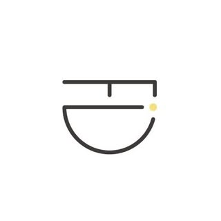

<div align="center">



# FID · 피드디자인

### 공간에 진심을 더하다 — *Fidelity in Space*

주거·상업 인테리어 설계부터 시공까지, 공간의 모든 과정을 진심으로 기록하는 강남 인테리어 스튜디오

<br/>

[](https://fid-design.github.io/Interior/)
[](https://www.instagram.com/fid_interior/)
[](tel:01054976436)

</div>

---

## 🪟 우리의 이야기

> **화려함보다, 머무는 사람의 하루에 충실한 공간.**

FID(**FI**delity **I**n **D**esign)는 "충실함(Fidelity)"이라는 단어에서 출발했습니다.
유행을 좇는 화려한 인테리어가 아니라, **그 공간에서 살아갈 사람의 하루에 충실한 공간**을 만드는 것 — 그것이 우리가 일하는 방식입니다.

재료의 결, 빛이 들어오는 방향, 손이 닿는 질감 하나까지.
작은 진심이 모여 **오래 사랑받는 공간**이 된다고 믿습니다.

우리는 설계 도면 위의 선 하나로 끝내지 않습니다.
철거의 먼지부터 마지막 마감의 광택까지, 공간이 완성되는 **모든 과정을 기록**하고 책임집니다.

---

## 🎯 포부 (Our Vision)

| | |
|---|---|
| 🏡 **진심** | 시공 한 건, 한 건을 우리 집처럼. 눈에 보이지 않는 마감까지 정직하게. |
| 📐 **설계** | 시공 전 완성될 공간을 3D로 먼저 보여드리고, 함께 결정합니다. |
| 🧱 **기록** | "지금까지 FID가 담아온 공간" — 모든 현장을 사진과 영상으로 아카이빙합니다. |
| 🌏 **확장** | 강남을 시작으로, 진심이 통하는 곳이라면 어디든 공간을 만들어 갑니다. |

---

## 🛠 서비스

- **주거 인테리어** — 아파트 · 빌라 · 주택, 라이프스타일을 반영한 맞춤 설계와 시공
- **상업 공간** — 카페 · 매장 · 골프장 등 브랜드 정체성을 담은 공간 디자인
- **전체 리노베이션** — 철거부터 마감까지, 구조 · 동선 · 설비를 새롭게
- **설계 · 3D 컨설팅** — 완성될 공간을 미리 제안하고 함께 결정

---

## 💻 웹사이트 소개

흰색·베이지·검정 톤의 미니멀한 인테리어 브랜드 사이트입니다.
순수 **HTML · CSS · JavaScript**로만 만들어 별도 빌드 과정 없이 바로 동작합니다.

**주요 특징**

- 🎬 스크롤 스토리텔링 인트로 (로고 → 사진 확장 → 작업 몽타주 → 브랜드 카피)
- ⌨️ 타자기 애니메이션 카피 (홈 · CONTACT)
- 🎥 실제 인스타그램 작업 영상 자동재생 (모바일 대응)
- 🎵 우측 상단 배경 음악 토글 (직접 합성한 로열티프리 앰비언트 루프)
- 💳 색상 보정으로 사이트 배경과 일체화된 명함 카드
- 🔍 네이버·구글 검색 최적화(SEO) 전 항목 적용
- 📱 모바일 반응형

---

## 📁 폴더 구조

```
FID/
├── index.html              # 메인 페이지 (인트로·홈·서비스·작품·갤러리·대표영상·소개·문의)
├── library.html            # 인테리어 시공 사례 아카이브
├── robots.txt              # 검색로봇 수집 규칙
├── sitemap.xml             # 검색엔진용 사이트맵
├── serve.sh                # 로컬 정적 서버 keepalive 스크립트
├── .nojekyll               # GitHub Pages가 assets 폴더를 그대로 서빙하도록
│
├── assets/
│   ├── css/styles.css      # 전체 스타일 (색상 변수는 :root 상단)
│   ├── js/script.js        # 스크롤·타자기·영상·음악 인터랙션
│   ├── audio/
│   │   └── fid-ambient.wav # 배경 음악
│   └── img/
│       ├── brand/          # 로고 · OG 커버
│       ├── card/           # 명함 이미지
│       ├── gallery/        # 갤러리 사진 (golf-academy / residential)
│       └── works/          # 작품 영상 + 썸네일
│
└── source/                 # 원본 소재 (작업용 — 배포에는 불필요)
    ├── business-cards/     # 명함 원본 · 처리본
    ├── original-photos/    # 인테리어 원본 사진
    └── references/         # 디자인 레퍼런스
```

---

## 🚀 로컬에서 실행

```bash
cd FID
python3 -m http.server 5199
# 브라우저에서 http://localhost:5199 접속
```

또는 keepalive 스크립트로 백그라운드 상시 실행:

```bash
./serve.sh        # 5199 포트가 죽어 있으면 자동 기동
```

---

## 🌐 배포 (GitHub Pages)

이 저장소는 **정적 사이트**라 GitHub Pages에 그대로 올리면 됩니다.

1. 저장소에 푸시 → **Settings → Pages**
2. *Source*: `Deploy from a branch` → `main` / `(root)` 선택
3. 잠시 후 `https://fid-design.github.io/Interior/` 에서 공개

> 커스텀 도메인(예: `fidinterior.co.kr`) 연결 시, `index.html`·`sitemap.xml`·`robots.txt`의
> URL과 SEO 메타의 `https://fid-design.github.io/Interior/` 부분만 일괄 교체하세요.

---

## 🔍 검색 최적화 (SEO)

네이버·구글 검색 노출을 위해 다음이 적용되어 있습니다.

- ✅ 네이버 서치어드바이저 / 구글 서치콘솔 **인증 meta** (코드만 교체)
- ✅ 155~160자 **메타 설명** · 인테리어 핵심 키워드
- ✅ **Schema.org 구조화 데이터** (LocalBusiness · 서비스 · 지역 · 영업시간)
- ✅ **Open Graph / Twitter 카드** (공유 미리보기)
- ✅ 시맨틱 **H1/H2** · 이미지 **alt 텍스트** · 내부 링크
- ✅ **robots.txt** · 이미지 포함 **sitemap.xml**

네이버 검색엔진 동작 원리부터 인테리어 키워드 상위노출 전략, 30/60/90일 로드맵까지
자세한 내용은 **[`SEO-GUIDE.md`](SEO-GUIDE.md)** 를 참고하세요.

---

## 📞 문의

| | |
|---|---|
| **전화** | 010-5497-6436 |
| **이메일** | homicid1@naver.com |
| **인스타그램** | [@fid_interior](https://www.instagram.com/fid_interior/) |
| **주소** | 서울시 강남구 테헤란로79길 6, 3층 1405호 |
| **사업자등록번호** | 516-28-01963 (대표 가상길) |

<div align="center">
<br/>

**FID 피드디자인** · 공간에 진심을 더하다

© 2026 FID. All rights reserved.

</div>
